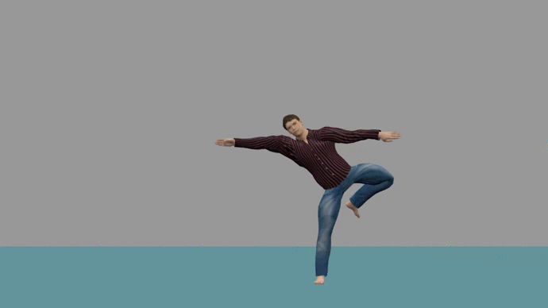
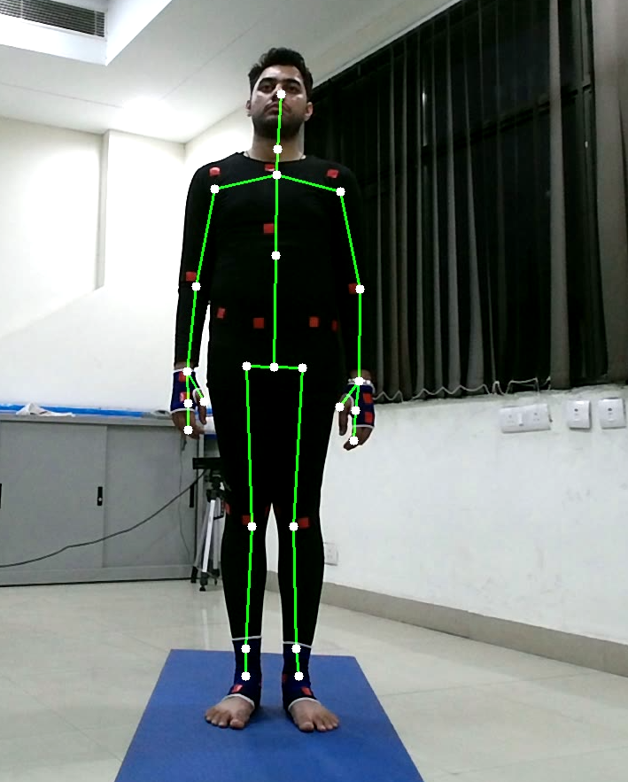
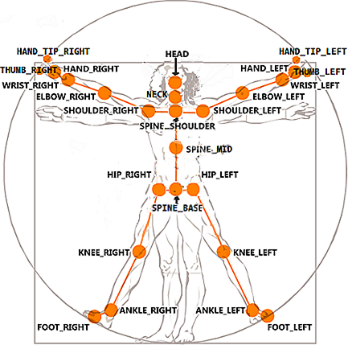
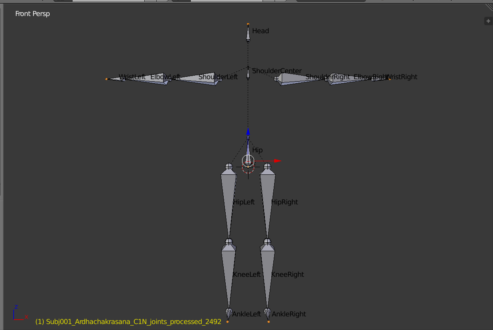

# Yoga-Animation

The aim of this project is to create 3D animation using Motion Captured files and Blender. Kinect SDK v2 is used for capturing joints positional data in csv format. This repo on github [kinect-openni-bvh-saver](https://github.com/meshonline/kinect-openni-bvh-saver) is used for converting raw Kinect jointsCSV data to bvh files.

<table>
    <tr>
        <td></td>
        <td></td>
    </tr>
</table>

## **Requirements**
- Windows10 or Linux
- Blender v2.79
- required plugins for blender
    1. Makewalk
    2. import_runtime_MHX2
- Makehuman 1.1.0

## *Getting Familiar with the Datasets*

### Kinect output Joints CSV files(files present in *csv_to_bvh/rawCSV*)
 -  Kinect v2 identifies 25 joints of a human model
 
<table>
    <tr>
        <td></td>
    </tr>
</table>

 - Kinect outputs a csv file according to the following format: person, timestamp, joint_type, tracked/inferred, frame_number, x_coordinate (image space 1920x1080), y_coordinate (image space), joint_position_x (Kinect camera uses IR depth sensor to find 3D coordinates in space in meters), joint_position_y (meters), joint_position_z (meters), joint_orientation_x (radians), joint_orientation_y (radians), joint_orientation_z (radians), joint_orientation_w
 
 <table>
    <tr>
        <td></td>
    </tr>
</table>

 - We process these rawCSV files to different csv file format(files present in **csv_to_bvh/processedCSV**) in which every line contains joint coodinates and tracked/inferred information for all joints types and where first column is timestamp shows time when that specific frame is captured 

### BVH Files(Files present in *bvhFiles/*)
 - A BVH file contains moving skeleton information and it has its specific format for containing the data, more information can be found [here](http://www.cs.cityu.edu.hk/~howard/Teaching/CS4185-5185-2007-SemA/Group12/BVH.html)
 - we used  [kinect-openni-bvh-saver](https://github.com/meshonline/kinect-openni-bvh-saver) code for converting our joints csv data to bvh format, However some changes were made to use this code, this code converts live feed from kinect into bvh file, also is uses NiTE to get joint locations, changes were made to make it possible for it to use existing joint data collected from using kinect and kinect api.(The joints recorded differ in kinect api and NiTE)

- Our BVH skeleton has 15 joints shown in image below
 
 
  

### MakeHuman Mhx2 model(Files present in *characters/*)  
- Make human model is a 3d human model which is a collection of skin mesh and its specified rig, we can use blender3D software for retargetting motion capture data exist in bvh files to mhx2 model and get the synthetic human animation.
- makehuman and its plugis can be downloaded from [here](http://files.jwp.se/archive/releases/1.1.0/)

 

## **How to use**
 - Clone the repository
 - Use makehuman to create a human model and export it as a mhx2 model
 - since our code uses processed csv format to converts it into bvh file therefor code for converting kinect output csv file to processed csv format is(it is assumed that all the rawCSV files are present in *csv_to_bvh/rawCSV* directory)
    - `$ python write_rawjointsFiles.py`  which will list out all the files present in rawCSV directroy to a text file raw_csv.txt and then run the code  `$ bash myCSVgenerator.sh` to convert rawCSV files to processed CSV files

    - `$ python write_processedjointsFiles.py`  which will list out all the converted processed files present in processedCSV directroy to a text file processed_csv.txt and then run the code  `$ bash myBVHgenerator.sh` to convert rawCSV files to processed CSV files

- or directly convert all the rawCSV files to BVH files , run the code
    - `$ bash toBVH.sh`

**Code to generate Animation**
- Code can be used for generating animation video and also tracking coordinates of each vertices of mhx2 model in image space
- Code to run for *single animation video*
- *--FramestoRetarget* is an optional input, it represent how many frames out of present in bvh file to be retargetted, default value will be all the frames present in bvh file

    - `$ bash run_render.sh --bvhFile {your input bvh file}  --mhx2File {your input mhx2 file} --fps {input frame rate(type-int)} --FramesToRetarget {input of total number of frames you want to retarget(optional) type-int} --videoFormat {input video file format(default is FFMEPG)} --Animation True`

- Code to run for *point tracking*

    - Just need to copy the above code and remove *--Animation True* and enter *Point_tracking True* rest format remains same, it will generate x_coordinate,y_coordinate in image pixel-space for each vertices and z_coordinate which is distance of vertex from camera object in blender

    - `$ bash run_render.sh --bvhFile {your input bvh file}  --mhx2File {your input mhx2 file} --fps {input frame rate} --FramesToRetarget {input of total number of frames you want to retarget(optiona)} --videoFormat {input video file format(default is FFMEPG)} --Point_tracking True`

- Get the animation for all the bvh files for each mhx2 model, run the code

    - `$ bash run_render_All.sh --fps {input frame rate} --FramesToRetarget {input of total number of frames you want to retarget(optional)} --videoFormate {input video file format} --Animation True`

