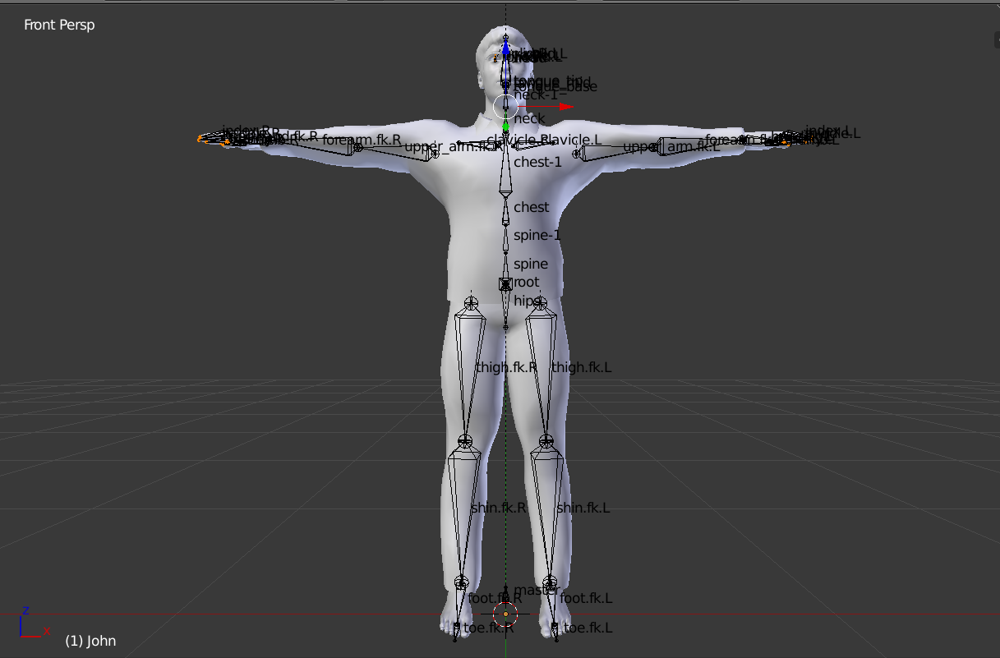
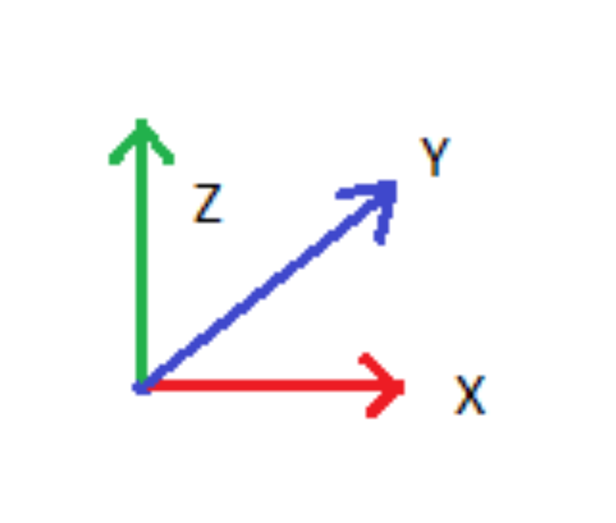

# Yoga-Animation

The aim of this project is to create 3D animation using Motion Captured files and Blender. Kinect SDK v2 is used for capturing joints positional data in csv format. This repo on github [kinect-openni-bvh-saver](https://github.com/meshonline/kinect-openni-bvh-saver) is used for converting raw Kinect jointsCSV data to bvh files.

<table>
    <tr>
        <td></td>
        <td></td>
    </tr>
</table>

## **Requirements**
- python 3.6
- Blender v2.79b
- Makehuman 1.1.0
- this code is developed on Windows10 ,can also be used on Linux

## Contents
* [Requirements](#requirements)
* [Getting Familiar with Datasets](#Getting-Familiar-with-the-Datasets)
    * [Kinect Output files](#Kinect-output-Joints-CSV-files)
    * [BVH Files](#BVH-Files)
    * [MakeHuman mhx2 model files](#MakeHuman-Mhx2-model-files)
* [Setup for blender](#Setup-for-Blender)
* [How to Use](#How-to-use)
* [Command Line Arguments](#command-line-arguments)
* [How to Generate Animation](#How-to-Generate-Animation)

## *Getting Familiar with the Datasets*

### Kinect output Joints CSV files
 -  Kinect v2 identifies 25 joints of a human model
 
<table>
    <tr>
        <td></td>
    </tr>
</table>

 - Kinect outputs a csv file according to the following format: person, timestamp, joint_type, tracked/inferred, frame_number, x_coordinate (image space 1920x1080), y_coordinate (image space), joint_position_x (Kinect camera uses IR depth sensor to find 3D coordinates in space in meters), joint_position_y (meters), joint_position_z (meters), joint_orientation_x (radians), joint_orientation_y (radians), joint_orientation_z (radians), joint_orientation_w
 
 <table>
    <tr>
        <td></td>
    </tr>
</table>

 - We process these rawCSV files to different csv file format(files present in **csv_to_bvh/processedCSV**) in which every line contains joint coodinates and tracked/inferred information for all joints types and where first column is timestamp shows time when that specific frame is captured 

### BVH Files
 - A BVH file contains moving skeleton information and it has its specific format for containing the data, more information can be found [here](http://www.cs.cityu.edu.hk/~howard/Teaching/CS4185-5185-2007-SemA/Group12/BVH.html)
 - we used  [kinect-openni-bvh-saver](https://github.com/meshonline/kinect-openni-bvh-saver) code for converting our joints csv data to bvh format, However some changes were made to use this code, this code converts live feed from kinect into bvh file, also is uses NiTE to get joint locations, changes were made to make it possible for it to use existing joint data collected from using kinect and kinect api.(The joints recorded differ in kinect api and NiTE)

- Our BVH skeleton has 15 joints shown in image below
 
 
  

### MakeHuman Mhx2 model files
- Make human model is a 3d human model which is a collection of skin mesh and its specified rig, we can use blender3D software for retargetting motion capture data exist in bvh files to mhx2 model and get the synthetic human animation.
- makehuman and its plugis can be downloaded from [here](http://files.jwp.se/archive/releases/1.1.0/)

 

## Setup for Blender

- before generating animation using our code, blender setup is required
-  blender addons can be found here on this [link](http://files.jwp.se/archive/releases/1.1.0/) which includes some addons for blender        and also same makehuman version from where we created our mhx2 model
- list of addons for blender what we used is 
    - import_runtime_mhx2
    - makewalk
    - maketarget
- after this enabling these addons is required , which can be done by accessing blender setting --> user-preferences--> addons
- also enabling of existing addon such as **Simplify Curves** also required   
- enable **auto_run_python_script** from blender setting --> user-preferences--> File

## **How to use**
 - Clone the repository
 - set blender as an environmental variable
 - Use makehuman to create a human model and export it as a mhx2 model
 - to generate bvh files for kinect joints data files
    - bash script **myCSVgenerator.sh** do that job and it takes one command line argument as location of kinect output files
    - `$ bash myCSVgenerator.sh {input folder location where kinect output file exist}`, it will convert kinect raw output csv files to processed CSV files which will be generated in **csv_to_bvh/processedCSV** folder

    - `$ bash myBVHgenerator.sh` to convert all processed joints output to bvh files which will be generated in **bvhFiles** folder

    - alternatively both the processess mentioned above can be done with single line of code `$ bash toBVH.sh {command line input -         folder where kinect output file exist}`

## Command line arguments
- our animation code takes these command line arguments
<table style="border-collapse: collapse;">
    <tr>
        <th>Command line Arguments</th>
        <th>Remarks</th>
    </tr>
    <tr>
        <td>--bvhFile</td>
        <td>(compuslory) - location of bvh file for which animation will be generated(string)</td>
    </tr>
    <tr>
        <td>--mhx2File</td>
        <td>(compuslory) - location of makehuman mhx2 model file for which animation will be generated(string)</td>
    </tr>
    <tr>
        <td>--fps</td>
        <td>(compuslory) - input for frame per second for animation(int)</td>
    </tr>
     <tr>
        <td>--FramesToRetarget</td>
        <td>(optional) input for total number of frames to 
        be retargetted out of total frames available in bvh file 
        for animation(int,default value is all the frames exist in bvh file)</td>
    </tr>
     <tr>
        <td>--videoFormat</td>
        <td>(compuslory) -image format for animation video(string)</td>
    </tr>
    <tr>
        <td>--background_image</td>
        <td>(compuslory) - complete path for background image for animation</td>
    </tr>
     <tr>
        <td>--Animation</td>
        <td>True or False (boolean, True for generating animation video, default = False)</td>
    </tr>
     <tr>
        <td>--Point_tracking</td>
        <td>True or False (boolean, True for generating tracking files, default = False)</td>
    </tr>
    <tr>
        <td>--camera_location</td>
        <td>(optional) - string format in format "(x-cord,y-cord,z-cord)", default is "(0,-3,0)" which is for our purpose</td>
    </tr>
    <tr>
        <td>--camera_rotation</td>
        <td>(optional) - string format in format "(x-rot,y-rot,z-rot) in radians", default is "(1.57,0,6.28)" which is for our purpose</td>
    </tr>
    <tr>
        <td>--is_preview</td>
        <td>(compuslory) - this variable holds boolean value, if true then visualization of the camera view for video rendering is enabled and it will automatically pop up and stops the code for further executing, it will asks for input for further executing(default=True), purpose of this parameter is to set camera location and rotation, value for this parameter should be false for execution of this code for lots of animation rendering</td>
    </tr>
    
</table>

## How to Generate Animation
- Code can be used for generating animation video and also tracking coordinates of each vertices of makehuman mhx2 model in image pixel space and also in 3D space of blender interface(camera location as reference point, same as in kinect IR depth sensor locate space coordinates)

- **Single animation video for given input files**
    - we need to feed two input files for animation, one is mocap bvh file and another is makehuman mhx2 model
    - for generating Animation as output, boolean *--Animation* should be *True*
    - for generating point tracking files for as output, boolean *--Point_tracking* shoul be *True*
    - or you can generate both simultaneously by giving both of these boolean command line argument value *True*  such as
    - `$ bash run_render.sh --bvhFile {your input bvh file}  --mhx2File {your input mhx2 file} --fps {input frame rate(type-int)}            --FramesToRetarget {input of total number of frames you want to retarget(optional) type-int} --videoFormat {input video file format(default is FFMEPG)} --background_image {complete path for background image} --Animation {True or False} --Point_tracking {True or False} --camera_location {input camera location} --camera_rotation {input camera rotation} --is_preview True` 

    - the code will generate a preview rendered image of camera view and stops for further execution, this can help to set camera location correct as required  
    <table>
    <tr>
    <td></td>
    <td><b>blender world coordinate system, imported mhx2 model in blender faces towards negative y-axis</b></td>
    </tr>
    </table>
    - this is for verifying that set camera location gives view range satisfactory for animation so that we can proceed further, it asks    for permission to continue("1") or stop("0") the code and reset camera location

- **Generating animation video files for all the bvh file generated in *bvhFiles* folder**

   - `$ bash run_render_All.sh --fps {input frame rate} --FramesToRetarget {input of total number of frames you want to retarget(optional)} --videoFormate {input video file format} --background_image {complete path for background image} --Animation {True or False} --Point_tracking {True or False} --camera_location {input camera location} --camera_rotation {input camera rotation} --is_preview False` , can also run for the point tracking.

